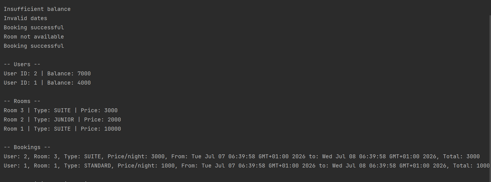

# Hotel Reservation System – Java Technical Test

This is a simplified Hotel Reservation System implemented in Java as part of a technical test.

## 📋 Description

The system allows:
- Creating and updating **Rooms** (with type and price).
- Creating **Users** with a balance.
- Booking a room if:
  - The room is available in the selected period.
  - The user has enough balance.
- Displaying all users, rooms, and bookings from newest to oldest.

All data is stored in memory using `ArrayList`. No database or external libraries used.

## 🚀 Technologies

- Java 17
- Maven (build system)
- No external dependencies

## 🧪 How to Run

1. Open the project in **IntelliJ IDEA**
2. Build with Maven (project auto-detected)
3. Run `Service.java` (contains main method with test scenario)

## 📦 Features Tested

- Booking with sufficient/insufficient balance
- Overlapping room reservations
- Invalid dates
- Dynamic updates to room data without affecting past bookings

## 📸 Test Result Screenshot

Voici le résultat attendu après exécution du scénario de test :

